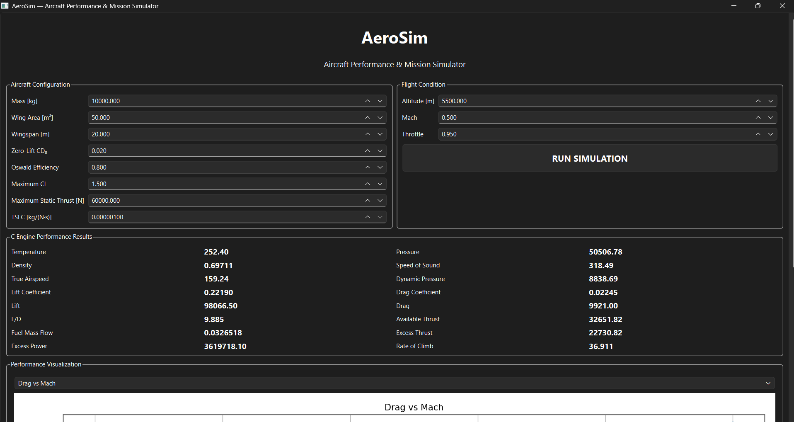
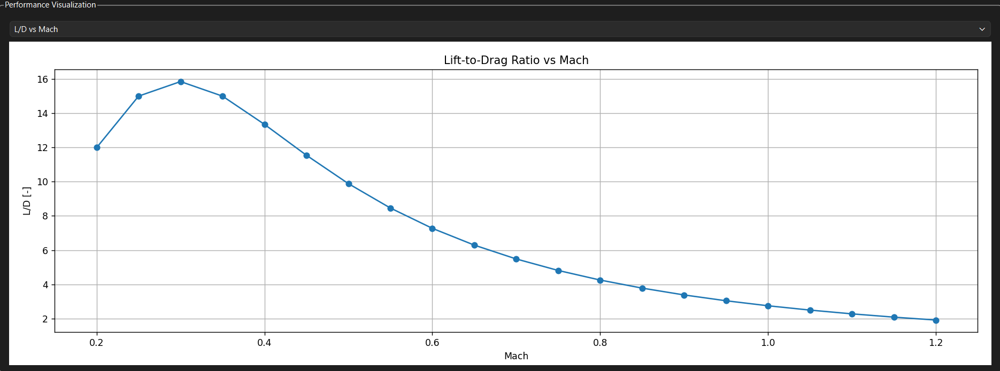
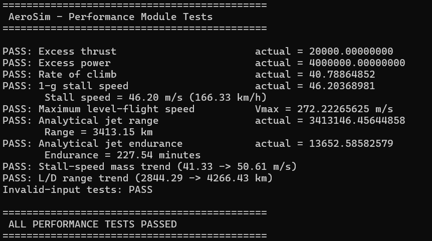
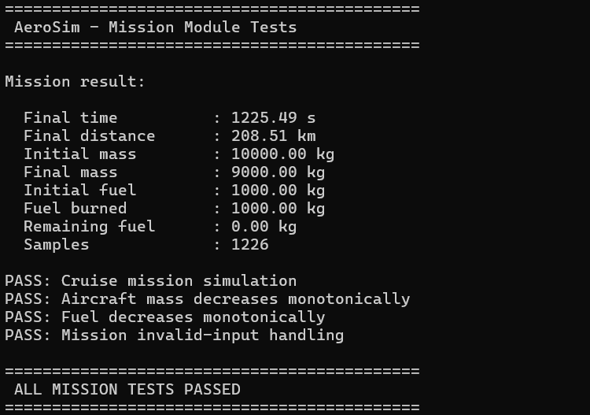

              ✈️ AEROSIM
       Aircraft Performance &
          Mission Simulator

   Physics Engine → Simulation → Analysis

------------------------------------------------

🚀 FEATURES

🌡️ ISA Atmosphere
🛩️ Aerodynamics
🔥 Propulsion
📈 Performance Analysis
🛰️ Mission Simulation
🐍 C ↔ Python Integration
📊 Visualization
🖥️ Interactive UI

------------------------------------------------

🏗️ ARCHITECTURE

        Python / UI
             │
          ctypes
             │
             ▼
       C Physics Core
             │
    ┌────────┼────────┐
    ▼        ▼        ▼
Atmosphere  Aero  Propulsion
             │
             ▼
        Performance
             │
             ▼
          Mission

------------------------------------------------

🛠️ TECH STACK

C • Python • ctypes • PySide6 • Matplotlib

------------------------------------------------

## 📸 AeroSim in Action

### Interactive Desktop Interface

### Performance Analysis

### Performance Engine Validation

### Mission Simulation

------------------------------------------------

🚧 STATUS

Physics Engine       ██████████ 100%
Python Integration   ██████████ 100%
Visualization        ██████████ 100%
Desktop UI           ████████░░ 80%
Web Platform         ██░░░░░░░░ 20%

------------------------------------------------

🗺️ NEXT

→ Interactive aircraft explorer
→ Live telemetry
→ Mission planner
→ Web-based simulator
→ 3D flight visualization

------------------------------------------------

⚠️ Educational / research simulation.